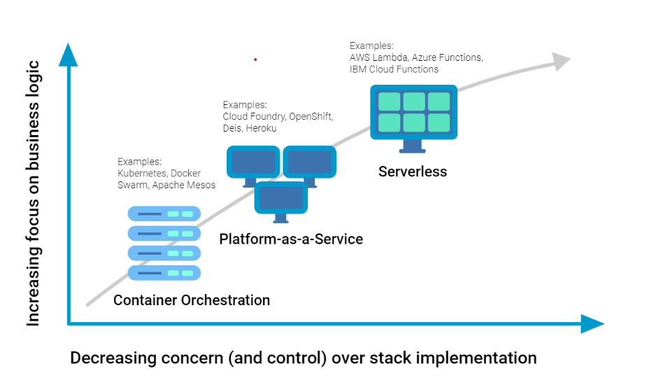

# Serverless 101

Serverless computing, also commonly known as **Function as a Service** or **Faas**,
is the fourth revolution of the cloud computing industry. According to the Cloud Native Computing Foundation (CNCF) serverless computing means the following:

> Serverless computing refers to the concept of building and running **applications** that **do not require server management**.
> It describes **a finer-grained deployment model** where applications, bundled as one or more **functions**, are uploaded to a platform and then **executed,
> scaled and billed in response to the exact demand needed at that moment**. [CNCF WG-Serverless Whitepaper v1.0](https://github.com/cncf/wg-serverless/blob/master/whitepapers/serverless-overview/cncf_serverless_whitepaper_v1.0.pdf)

Serversless computing goes against the idea of **idling servers** with application code sitting there **waiting for work**. Unlike in real life the following situation does not exist in a serverless world!

Provisioning, monitoring, patching and scaling servers does also not exist in a serverless world. In fact just like toll roads you only pay for the moment you drive on the tollroad and you do not need to worry about maintaining the road infrastructure. Unlike serverless,toll roads do no scale infinitely when the traffic spikes.

Being able to shift most of your resources to focus on coding business logic for your digital products. The fact that you only pay for the time your application is running and knowing that it scales infinitely by default is a very powerfull premise! Does this mean that servers do not exist anymore? No, the responsibility of provisioning and managing servers is shifted even more towards the cloud providers like AWS, Microsoft Azure, Google Cloud etc.

The above diagram s
The first revolution in Serverless computing

# Draft notes
The above 
- Speed of innovation over depth of customization
- Deferred risk over extensive ownershop
- Costs for actual use over costs for predicted use
- Scalability by defaulf over scalability by design
- Managed services over custom infrastructure

To achieve  the benefits of serverless, you will have to change the way you create application.
Going serverless is like adhering to a vegie lifestyle - instead of no meat, no custom infrastructure! 

3party tools for serverless deployments
Serverless Framework, Terraform, Pulumi, Claudia.js, Zappa, Architect

AWS: Cloudformation, SAM, Cloud Development Kit